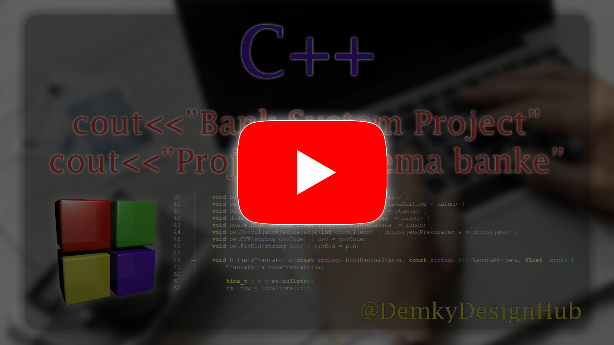

# 💳 Bank System Project

The **Bank System Project** represents my first significant work in an object-oriented programming (OOP) environment. It is written in **C++**, utilizing core features such as classes with attributes and methods, inheritance, vectors, structures, and more.

This banking system is primarily based on **CRUD functionalities**, offering both **admin** and **user panels**.  
On the **administrator side**, it provides full control over account management (both current and savings accounts), as well as user account creation, editing, and deletion (admin and regular users).  
On the **user side**, the system enables operations such as:

- Transferring money between accounts  
- Viewing account balance  
- Viewing a complete history of all transactions  
- Requesting loans (only creditworthy users are eligible)  

Each user is associated with one account, but this can be modified by the admin panel when needed.

The system was designed with flexibility in mind and provides a modular codebase suitable for further upgrades and scalability. The command-line interface offers a clean experience while demonstrating the core logic behind the system.

📽️ I highly recommend watching the video below to better understand the system’s functionality and the algorithms it uses in real-world scenarios.

## ▶️ YouTube Overview

## ✉️ Contact

  

## 👍 Feedback

If you have any feedback on this project, alternative approaches to structuring the code, or suggestions for future improvements, feel free to share your thoughts. I truly appreciate your time in reviewing this project. Best regards!
